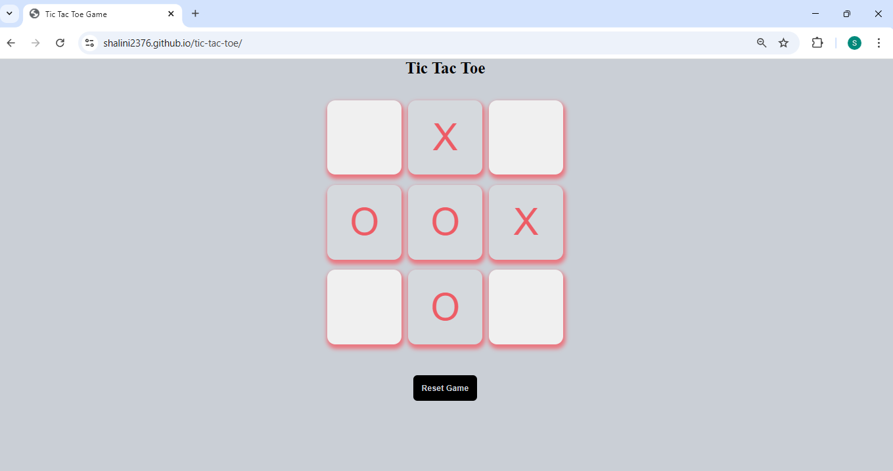

# Tic Tac Toe

A simple browser-based **Tic Tac Toe game** built using **HTML, CSS, and JavaScript** as part of frontend practice.  
This project focuses on implementing basic game logic and DOM manipulation.

## ✨ Features
- Two-player turn-based gameplay
- Win and draw condition detection
- Dynamic UI updates based on game state
- Reset and replay functionality
- Clean and simple interface

## 🛠 Tech Stack
- HTML5
- CSS3
- JavaScript (Vanilla)

## Screenshot


## ▶️ How to Run Locally

1. Clone the repository:
   ```bash
   git clone https://github.com/shalini2376/tic-tac-toe.git
   ```
2. Open the project folder.
 
3. Open index.html in your browser.


